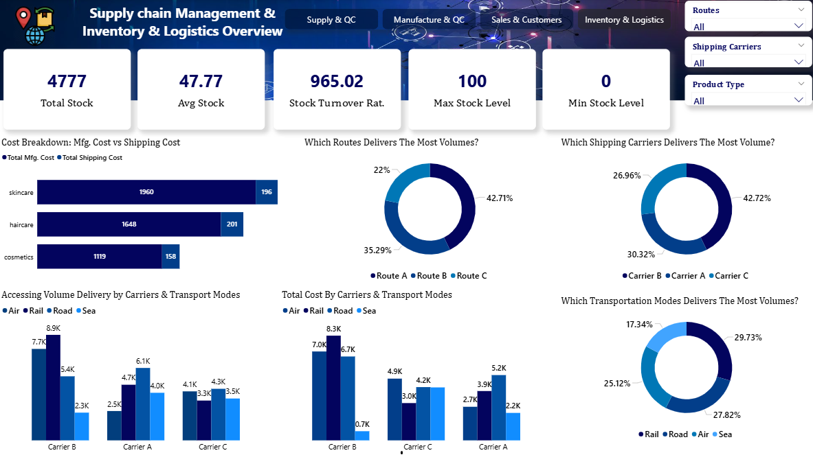
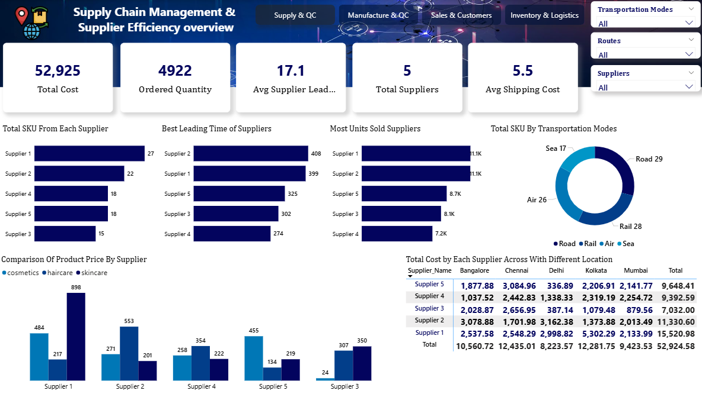

 ## 📊 Supply Chain Analytics Dashboard

### 🔍 Project Overview
- Designed a **Supply Chain Analytics Dashboard** to analyze and visualize key supply chain metrics.
- Monitored **production volume, manufacturing cost, product efficiency, defect rates, and lead times**.
- Enabled **data-driven decision-making** by identifying inefficiencies, quality issues, and performance gaps across the supply chain.

### 🎯 Problem Statement
- Lack of visibility into production efficiency.
- High defect rates and quality issues.
- Inefficient supplier performance.
- Delays in manufacturing and logistics.

### 🧩 Key Features
- 📈 Production volume and efficiency analysis.
- 🏭 Manufacturing cost and lead time tracking.
- ✅ Quality control and defect rate monitoring.
- 🤝 Supplier performance comparison.
- 📦 Inventory and logistics insights.
- 🎛️ Interactive filters (location, product type, inspection results).

### 🛠️ Tools & Technologies Used
- **Power BI** – Dashboard creation and data visualization.
- **Excel / CSV** – Data cleaning and preprocessing.
- **Data Analysis Techniques** – KPI calculation and trend analysis.
- **GitHub** – Version control and project hosting.

## 📊 Dashboard Screenshots

### 📦 Inventory & Logistics

### 🏭 Manufacturing & Quality Control

### 🛒 Sales & Customers

### 🔍 Supply & Quality Control

